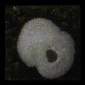

# Infinite Forams most beautiful and most wonderful

This was a project training a StyleGAN network to generate a potentially infinite series of parallel universe microfossils, based on the amazing collection of samples at [Endless Forams](http://endlessforams.org/)

## Data Access

Data available here (open access, with bulk download of entire training set planned but not currently high priority)
http://endlessforams.org/

Download resource pattern goes like this:

http://endlessforams.org/randomizer/download/[classification]/[total]?download=capsule.zip

Very convenient list of classifications and number of available samples here:
http://endlessforams.org/summary

## Code

Most of this was based on the notebooks and training routines in the [stylegan-art](https://github.com/ak9250/stylegan-art) project.
It's now shifted to StyleGAN2 re-using the NVLabs[Tensorflow implementation](https://github.com/NVlabs/stylegan2).
Running the code requires a checkout of `stylegan2` in one's `PYTHONPATH`.

The main addition is a bit of image processing, trying to extract just the foram shape from the original sources, which also include a lot of text metadata. This was a rough and ready approach involving Yen thresholding from scikit-image, falling back to Otsu thresholding if Yen didn't extract a region with the right area, then looking for the most square of the largest regions in the image.

This was the output from a test run on a Google Colab GPU up to the end of the free 12 hour runtime. Hopefully a longer run would produce much more compellingly detailed images of unreal forams.

## Next Steps

* Do a much longer training run to improve image quality
* Generate a lot of parallel universe forams, hierarchically cluster them into an imaginary taxonomy, and generate names for the imaginary taxonmy. Then train a [microfossil classifier](https://github.com/metazool/nannotrax) on that data to identify imaginary forams

